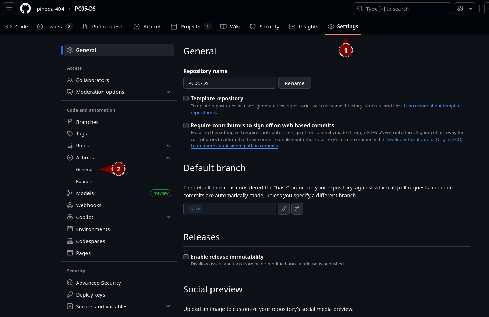
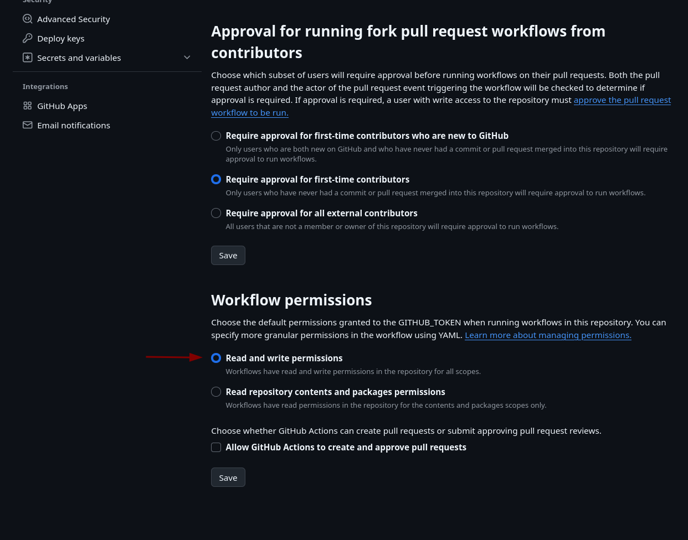

# Release Radar

## Información del Equipo

**Integrantes:**

- Pineda García Diego Ronaldo
- Torres Fuero Mateo Lorenzo
- Trujillo Serva Luis Andre

**Videos de Presentación:**

- Sprint 1: https://www.youtube.com/watch?v=sauU2P8f3-0
- Sprint 2: https://www.youtube.com/watch?v=1jmBz7Peg6Y
- Sprint 3: https://www.youtube.com/watch?v=n82gylBdVDA

## Descripción del Proyecto

Release Radar es un sistema de análisis de riesgo que evalúa automáticamente releases antes de deployarlos a producción. El sistema simula métricas de staging (error rate, latency, throughput), las analiza contra umbrales predefinidos, y decide si un release es seguro o riesgoso.

### Problema que Resuelve

**Escenario típico sin Quality Gate:**

```
Developer → Merge → Deploy Producción →  Error rate 5%
                                      → Clientes afectados
                                      → Rollback manual
```

**Con Release Radar:**

```
Developer → Merge → Deploy Staging → Análisis → ¿OK?
                                              ↓
                                    OK →  Deploy Prod
                                    RISKY →  Block
```

### Componentes

- **FastAPI**: API REST que registra releases y analiza métricas
- **Classifier**: Lógica de negocio que evalúa umbrales de riesgo
- **Generate Metrics**: Script que simula métricas de staging
- **GitHub Actions**: 4 workflows de CI/CD
- **Docker**: Contenerización con mejores prácticas de seguridad

### Umbrales de Calidad

| Métrica     | Umbral      | Clasificación si excede |
| ----------- | ----------- | ----------------------- |
| Error Rate  | > 2%        | RIESGOSO                |
| Latency P95 | > 300ms     | RIESGOSO                |
| Throughput  | < 100 req/s | RIESGOSO                |

Si **alguna** métrica excede su umbral → Release = **RIESGOSO**  
Si **todas** están dentro de umbrales → Release = **OK**

## Requisitos Previos

- Docker Desktop instalado y corriendo
- Python 3.10+ (para desarrollo local)
- Git
- Cuenta de GitHub (para GitHub Actions)

### Opcional (para desarrollo local):

- Virtual environment (`venv` o `virtualenv`)

## Instalación de Requisitos

### Docker Desktop

**Linux:**

```bash
# Usando el script oficial
curl -fsSL https://get.docker.com -o get-docker.sh
sudo sh get-docker.sh

# Agregar usuario al grupo docker
sudo usermod -aG docker $USER
# Cerrar sesión y volver a entrar
```

**macOS:**

```bash
# Descargar desde: https://www.docker.com/products/docker-desktop
# O usando Homebrew:
brew install --cask docker
```

**Windows:**

```powershell
# Descargar desde: https://www.docker.com/products/docker-desktop
# Requiere WSL 2
wsl --install
```

### Python 3.10+

**Linux:**

```bash
# Ubuntu/Debian
sudo apt-get update
sudo apt-get install python3.10 python3.10-venv python3-pip
```

**macOS:**

```bash
brew install python@3.10
```

**Windows:**

```powershell
# Descargar desde: https://www.python.org/downloads/
# O usando Chocolatey:
choco install python --version=3.10.0
```

### Verificación de Instalación

```bash
docker --version
python3 --version
git --version
```

## Inicio Rápido

### 1. Clonar el Repositorio

```bash
git clone https://github.com/pineda-404/PC05-DS.git
cd PC05-DS
```

### 2. Levantar con Docker Compose

```bash
# Construir y levantar API
docker-compose up --build -d

# Verificar que está corriendo
curl http://localhost:8000/health | jq
```

### 3. Probar el Sistema Localmente

```bash
# Generar métricas simuladas
python scripts/generate_metrics.py --version v1.0.0 --quality normal

# Ver métricas generadas
cat app/data/metrics/metrics-v1.0.0.json

# Registrar release en la API
curl -X POST http://localhost:8000/releases \
  -H "Content-Type: application/json" \
  -d "{
    \"version\": \"v1.0.0\",
    \"commit\": \"abc123\",
    \"metrics\": $(cat app/data/metrics/metrics-v1.0.0.json)
  }" | jq

# Analizar release
curl http://localhost:8000/analysis/v1.0.0 | jq

# Ver timeline de releases
curl http://localhost:8000/timeline | jq
```

### 4. Detener Servicios

```bash
docker-compose down
```

## Uso de GitHub Actions

### Workflows Disponibles

1. **CI Pipeline** (`ci.yml`)

   - Trigger: Push/PR a `main`
   - Ejecuta: Linting (ruff, black) + Tests (pytest)

2. **Build, Scan & SBOM** (`build_scan_sbom.yml`)

   - Trigger: Push/PR a `main`/`develop`, manual
   - Ejecuta: Build Docker → Trivy scan → Syft SBOM
   - Genera: `.evidence/trivy-report.json`, `.evidence/sbom.json`

3. **Release Analysis** (`release_analysis.yml`)

   - Trigger: Manual (`workflow_dispatch`)
   - Inputs: `version` (v1.0.0), `quality` (normal/risky/random)
   - Ejecuta: Genera métricas → Analiza → Clasifica
   - Genera: `.evidence/release-risk-report.json`, artifact `timeline`

4. **Deploy Simulation** (`deploy_dummy.yml`)
   - Trigger: Manual (`workflow_dispatch`)
   - Inputs: `version` (v1.0.0), `environment` (staging/production)
   - Ejecuta: Simula deploy
   - Genera: artifact `deploy-log`

### Ejecutar Release Analysis

```
1. Ve a GitHub → Actions
2. Click en "Release Analysis"
3. Click "Run workflow"
4. Inputs:
   - Version: v2.0.0
   - Quality: risky  (para demo de release riesgoso)
5. Run workflow
6. Espera ~2 minutos
7. Descarga artifacts:
   - release-risk-report
   - timeline-v2.0.0
```

### Ejecutar Deploy Simulation

```
1. Actions → Deploy Simulation → Run workflow
2. Inputs:
   - Version: v2.0.0
   - Environment: staging
3. Run workflow
4. Descarga artifact: deploy-log-v2.0.0
```

## Estructura del Proyecto

```
PC05-DS/
├── app/                        # Código de la API
│   ├── __init__.py
│   ├── main.py                 # FastAPI endpoints
│   ├── models.py               # Modelos de datos
│   ├── classifier.py           # Lógica de clasificación de riesgo
│   └── data/                   # Datos persistentes (métricas)
├── scripts/                    # Scripts de automatización
│   └── generate_metrics.py     # Generador de métricas simuladas
├── tests/                      # Tests unitarios
│   ├── test_api.py
│   └── test_classifier.py
├── .github/workflows/          # Workflows de CI/CD
│   ├── ci.yml
│   ├── build_scan_sbom.yml
│   ├── release_analysis.yml
│   └── deploy_dummy.yml
├── .evidence/                  # Evidencia auditada (committed)
│   ├── release-risk-report.json
│   ├── sbom.json
│   └── trivy-report.json
├── Dockerfile                  # Imagen Docker optimizada
├── docker-compose.yml          # Orquestación local
├── requirements.txt            # Dependencias Python
└── README.md                   # Este archivo
```

## Desarrollo Local

### Ejecutar sin Docker

```bash
# Crear entorno virtual
python3 -m venv venv
source venv/bin/activate  # Linux/Mac
# venv\Scripts\activate   # Windows

# Instalar dependencias
pip install -r requirements.txt

# Ejecutar API
uvicorn app.main:app --reload

# En otra terminal, ejecutar tests
PYTHONPATH=. pytest tests/ -v
```

### Ejecutar Linting

```bash
# Formatear código con black
black app/ tests/

# Check de linting
ruff check app/ tests/

# Verificar formato
black --check app/ tests/
```

### Ejecutar Tests

```bash
# Todos los tests
PYTHONPATH=. pytest tests/ -v

# Solo test_classifier
PYTHONPATH=. pytest tests/test_classifier.py -v

# Con coverage
PYTHONPATH=. pytest tests/ --cov=app --cov-report=html
```

## Evidencia Generada

### `.evidence/` (committed al repo)

- **`release-risk-report.json`**: Reporte de análisis de cada release
- **`sbom.json`**: Software Bill of Materials de la imagen Docker
- **`trivy-report.json`**: Reporte de vulnerabilidades de seguridad

### Artifacts (GitHub Actions, 30 días)

- **`release-risk-report`**: Reporte de análisis (duplicado)
- **`timeline-{version}`**: Snapshot del timeline en el momento del análisis
- **`deploy-log-{version}`**: Log de simulación de deploy
- **`trivy-report`**: Reporte de Trivy (duplicado)
- **`sbom`**: SBOM (duplicado)

## Workflow del Quality Gate

### Flujo Conceptual en Producción

```
1. Developer → git push a main
2. CI Pipeline → Tests + Linting
3. Build → Docker image creada
4. Deploy Staging → Release v2.0.0 en staging
5. Métricas → Prometheus recolecta métricas reales
6. Release Analysis → Analiza métricas
7. Quality Gate:
   ├─ OK → Deploy a Production automático
   └─ RIESGOSO → Bloqueado, alertar equipo
```

### Flujo en el Proyecto (Simulado)

```
1. Deploy Simulation (manual)
   └─ Simula deploy a staging

2. Release Analysis (manual)
   └─ Genera métricas simuladas
   └─ Analiza y clasifica

3. Demostración:
   ├─ OK → "Safe to deploy to production"
   └─ RIESGOSO → "Deploy blocked"
```

## Sprints del Proyecto

### Sprint 1: Modelo de Release + Análisis

- API FastAPI básica
- Classifier con umbrales
- Tests unitarios
- CI Pipeline (linting + tests)

### Sprint 2: Integración con Métricas + Docker

- Script `generate_metrics.py`
- Dockerfile con buenas prácticas
- docker-compose.yml
- Workflow `release_analysis.yml`
- Workflow `build_scan_sbom.yml` (Trivy + Syft)

### Sprint 3: Timeline y Deploy Simulation

- Endpoint `GET /timeline`
- Workflow `deploy_dummy.yml`
- Snapshots del Timeline en `release_analysis.yml`

## Solución de Problemas

### Docker: "Cannot connect to Docker daemon"

```bash
# Verificar que Docker Desktop está corriendo
docker info

# Reiniciar Docker Desktop
# En Linux:
sudo systemctl restart docker
```

### API: "ModuleNotFoundError: No module named 'app'"

```bash
# Asegurar que tienes app/__init__.py
touch app/__init__.py

# Ejecutar con PYTHONPATH
PYTHONPATH=. python -m uvicorn app.main:app --reload
```

### Tests: "No module named 'app'"

```bash
# Ejecutar con PYTHONPATH
PYTHONPATH=. pytest tests/ -v
```

### GitHub Actions: "Permission denied" en git push

```bash
# Verificar configuración del repo:
# Settings → Actions → General → Workflow permissions
# → Seleccionar "Read and write permissions"
```





### Métricas no persisten

```bash
# Verificar que el directorio existe
mkdir -p app/data/metrics

# Verificar permisos (Linux/Mac)
chmod -R 755 app/data
```

## Tecnologías Utilizadas

- **Backend**: Python 3.10, FastAPI 0.104.1, Uvicorn 0.24.0
- **Testing**: pytest 7.4.3, httpx 0.25.1
- **Linting**: ruff 0.1.6, black 23.11.0
- **Containerización**: Docker, Docker Compose
- **CI/CD**: GitHub Actions
- **Seguridad**: Trivy (vulnerability scanning), Syft (SBOM generation)
- **Infrastructure**: Ubuntu-latest runners (GitHub Actions)

## Mejores Prácticas Implementadas

### Seguridad

- Usuario non-root en Docker (appuser)
- Imagen slim de Python (Python 3.10-slim)
- Security scanning con Trivy
- SBOM generation con Syft
- `.dockerignore` para excluir archivos sensibles

### CI/CD

- Linting automático (ruff, black)
- Tests automáticos (pytest)
- Quality Gate implementation
- Evidencia auditable (`.evidence/`)
- `[skip ci]` en commits de evidencia

### DevOps

- Healthcheck en Docker
- Volúmenes persistentes
- Scripts automatizados
- Documentación completa
